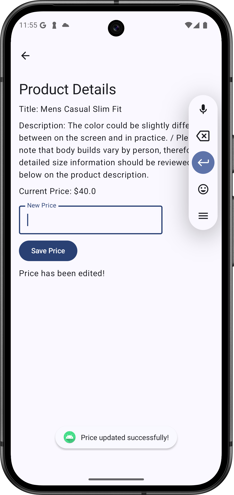

# 🛒 Product Price Editor App

This is a simple Android app built with Kotlin and Jetpack Compose. It uses the [Fake Store API](https://fakestoreapi.com/docs) to fetch and update products. The goal of this app is to display a list of products, allow users to view details of a selected product, and edit its price.

## 📱 Screenshots

| Product List Screen | Product Detail & Edit |
|---------------------|------------------------|
<p float="left">
  
  
</p>

## 🎥 Demo

 

 

## 🚀 Features

- Fetch and display a list of products
- View detailed info about a selected product
- Edit and update the product's price via the Fake Store API
- Handles loading, success, and error states
- Built using MVVM with CLEAN architecture

## 🛠️ Tech Stack

- **Language**: Kotlin
- **UI**: Jetpack Compose
- **Architecture**: MVVM
- **Dependency Injection**: Hilt
- **Networking**: Retrofit
- **Coroutines** for async handling
- **State Management**: StateFlow and Compose `collectAsState`

## 📦 API Reference

- [Fake Store API](https://fakestoreapi.com/docs)

Endpoints used:
- `GET /products` – Fetch all products
- `GET /products/{id}` – Get a single product
- `PUT /products/{id}` – Update product data

## 🧪 Testing

Basic UI and functional testing are performed using manual test cases to ensure:
- Products load correctly
- Edit and save functionality works
- Proper toast messages and UI feedback are shown

## 🏗️ Project Structure

```plaintext
com.example.producteditor
│
├── data/
│   ├── model/
│   ├── remote/
│
├── domain/
│   ├── usecase/
│
├── presentation/
│   ├── ui/
│   ├── viewmodel/
│
└── di/
